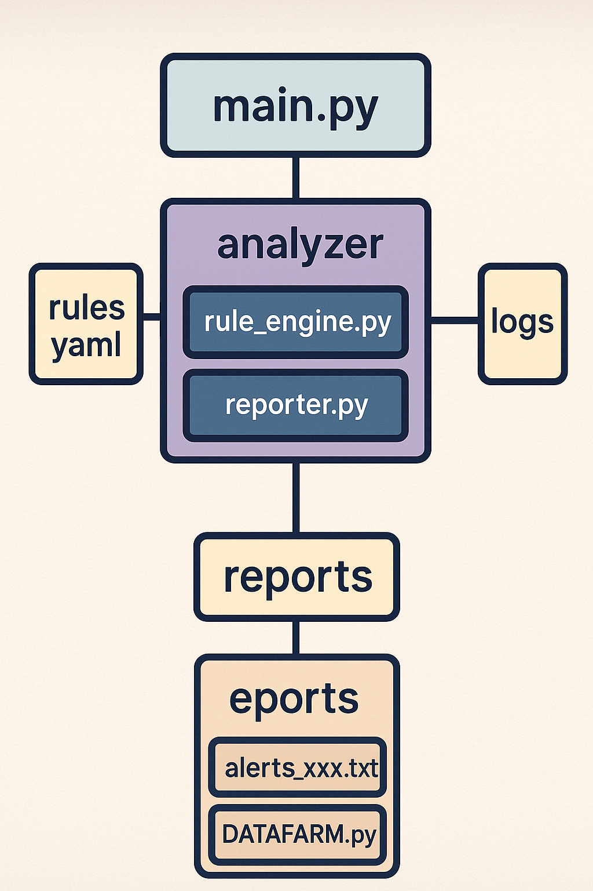
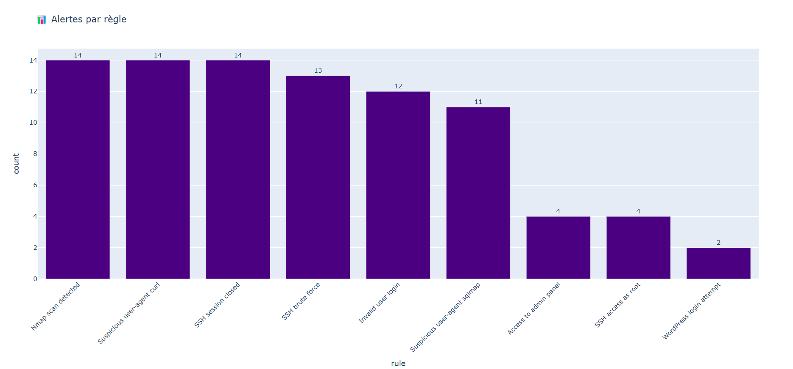
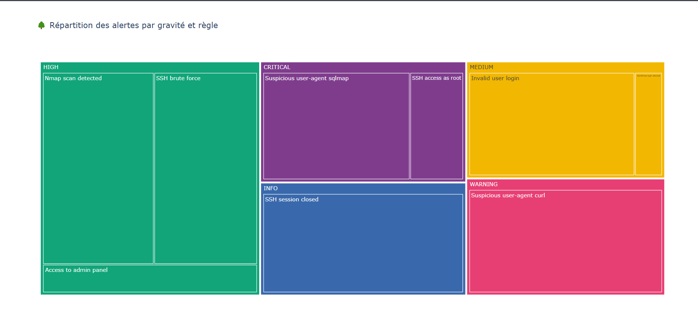

# 🔐 LogDefender — Smart Log Analysis & Threat Detection



**LogDefender** is a lightweight and modular log analysis system designed to detect suspicious behaviors in logs through rule-based parsing and dynamic data visualization.

---

## 📁 Project Structure

```
LogDefender/
│
├── main.py                   # Entry point — loads logs, applies detection rules, generates alert reports
├── analyzer/
│   ├── rule_engine.py        # Core logic for applying detection rules to log entries
│   └── reporter.py           # Generates text-based alert reports
│
├── rules/
│   └── default_rules.yaml    # YAML-based rules (regex patterns + severity levels)
│
├── logs/
│   └── access_log_sample.txt # Example logs (Apache-style format)
│
├── reports/
│   ├── alerts_*.txt          # Automatically generated reports based on alerts
│   ├── bar_rules.html        # Interactive bar chart of alert rules
│   └── treemap_gravite_rules.html # Interactive treemap of severity per rule
│
├── DATAFARM.py               # Optional advanced analysis script: plots & dashboards
├── docs/
│   └── assets/
│       └── LogDefender_Architecture.png  # Project architecture diagram
│
└── README.md                 # This file
```

---

## 🚀 Features

- 📜 Regex-based rule engine (YAML)
- 📊 Visual dashboards with Plotly (interactive HTML output)
- 📁 Auto-detects and parses the latest report
- 🧠 Extendable with your own rules and logs
- 📈 Detects tools like `sqlmap`, `curl`, `nmap`, and suspicious user-agents

---

## 🛠️ Installation

```bash
git clone https://github.com/your-username/LogDefender.git
cd LogDefender
pip install -r requirements.txt
```

> Make sure you are using **Python 3.8+**

---

## 📂 Usage

### 1. Run the main detection engine:

```bash
python main.py
```

This will:
- Load logs from the `logs/` folder
- Parse them using regex rules in `rules/default_rules.yaml`
- Generate an alert report in `reports/alerts_<timestamp>.txt`

### 2. Run advanced analytics & visuals:

```bash
python DATAFARM.py
```

This will:
- Read the latest report
- Generate bar and treemap charts in the `reports/` folder
- Save visuals as HTML (interactive) and PNG (static)

---

## 📊 Visual Output

You will get:

- 📈 `bar_rules.html` — number of alerts per rule  
- 🌳 `treemap_gravite_rules.html` — distribution by level + rule  
- 🖼️ PNG export (optional)


---

## 🧩 Custom Rules

Rules are stored in `rules/default_rules.yaml`.

Each rule is a dictionary:

```yaml
- name: "Suspicious curl"
  pattern: "curl"
  level: "warning"
```

You can add as many as you like. Levels: `info`, `warning`, `medium`, `high`, `critical`.

---

## 🛡️ Example Use Cases

- Detect SQL injection scans (`sqlmap`)
- Flag login brute force attempts
- Visualize trends in log-based attacks
- Quickly analyze raw Apache/Nginx logs

---

## 🖼️ Architecture Diagram

<p align="center">
  
</p>

---

## 👤 Author

**5Otien**  
_Powered by log parsing, visual insight and automation_

---

## 📄 License

This project is open-source and available under the MIT License.